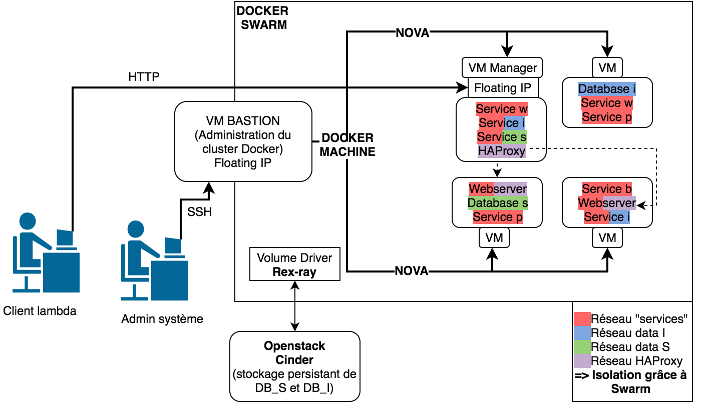

# CloudHP

##Architecture

##Architecture prévue

##How to deploy

-SSH into Bastion VM

-git clone the project

-Run the script ./init.sh.

You'll be asked for your Openstack password at the beginning,
the rest is 100% automated.

The script takes roughly 25min to complete.
